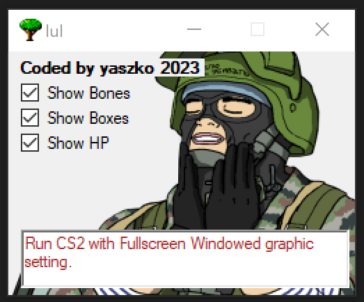

# CS2 External ESP
### Introduction
This is for educational purposes only. External cheat application for Counter-Strike 2 (PC) written in C# using `ReadProcessMemory Win API` and `GameOverlay NuGet` to provide live, on-screen ESP (Wallhack), undetectable by VAC.


### How to use
- Run CS2 with **Fullscreen Windowed** graphic setting
- Run HAX.exe ([download Release](https://github.com/michaljach/HAX/releases))
- Profit
### Version
Works with current CS2 version 
### Frameworks
- GameOverlay
- .NET 4.8
### Project structure
```
/Root
	/Assets <- icons, images
	/Classes
		Bones.cs <- Struct representing player model visible bones
		Entity.cs <- Player (Entity) class with all data like health, position etc
		Memory.cs <- Class for reading memory data and window handles
		Offsets.cs <- Struct with all used memory offsets (needs updating every CS release)
		Rect.cs <- Helper class for storing Top, Left, Right, Bottom coordinates
		Team.cs <- Enum with CT, Terrorist, Spectator memory values
		UI.cs <- On-screen drawing class using Direct2D1
		Utils.cs <- Helpers and utils
	/Main.cs <- App entry point
```
### TODO
- Dynamic Offsets updater
- Scan for CS2 process continously
- Aimbot
- Chams